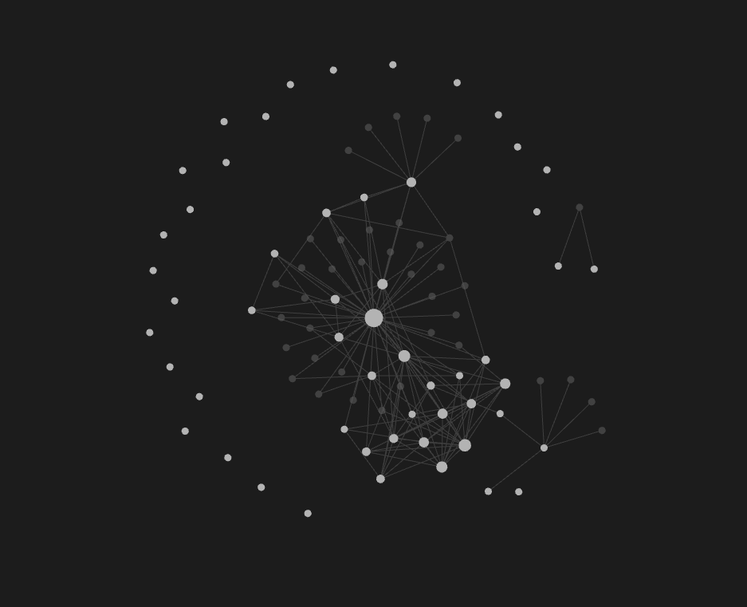
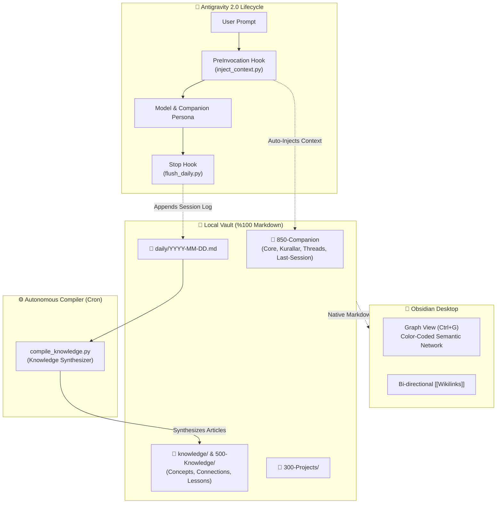

<p align="center">
  
</p>

<h1 align="center">Synapse-AG</h1>

<p align="center">
  <b>Autonomous, Self-Evolving AI Second Brain & Knowledge Engine for Google Antigravity 2.0 & Obsidian</b>
</p>

<p align="center">
  <a href="README_TR.md">🇹🇷 <b>Türkçe Dokümantasyon için Tıklayın</b></a>
</p>

<p align="center">
  <a href="#-license--attribution"></a>
  <a href="#-quickstart-single-prompt"></a>
  <a href="#-obsidian-integration"></a>
  <a href="#-system-architecture"></a>
  <a href="https://github.com/MertAlii/Synapse-AG"></a>
</p>

<p align="center">
  
</p>

---

## 💡 Overview

**Synapse-AG** is an autonomous AI second brain engine built natively for **Google Antigravity 2.0** and **Obsidian**. It solves the AI amnesia problem by automatically capturing sessions, adapting to learned rules, and compiling daily logs into evergreen knowledge articles without manual overhead.

* **🧠 Persistent Memory:** Lifecycle hooks (`PreInvocation`, `Stop`) automatically inject past session context and save structured logs into `daily/YYYY-MM-DD.md`.
* **📚 Autonomous Knowledge Compilation:** Background compilers synthesize raw daily logs into connected knowledge concepts (`knowledge/concepts/`, `knowledge/connections/`) following Andrej Karpathy's LLM Knowledge Base pattern.
* **💎 Obsidian Native & Pre-Configured:** Ready-to-use `.obsidian/` configuration with color-coded Graph View (`Ctrl+G`), Daily Notes, Templates, Canvas, and bi-directional `[[Wikilinks]]`.
* **🛡️ Zero Data Loss Upgrades:** Built-in semantic version tracking (`.beyin-version`) and `scripts/upgrade.ps1` allows upgrading core scripts while preserving 100% of your notes and data.
* **🔒 Concurrency & Safety:** Cross-platform file locking (`portalocker`) guarantees safe concurrent operations between subagents and background tasks.

---

## 🚀 Quickstart (Single Prompt Setup)

In your Google Antigravity 2.0 workspace, run:

```text
Read beyin-antigravity.md and build the second brain system in this workspace. When finished, report all installed components.
```

Or run the diagnostics command anytime:

```bash
python .agents/scripts/doctor.py
# Or in Antigravity chat: "beyin doktor"
```

---

## 🔄 Upgrading Synapse-AG

When a new version is released on GitHub, update your system without losing any personal notes or memories:

```powershell
.\scripts\upgrade.ps1
```

* **Protected Data (Never Touched):** `daily/`, `knowledge/`, `📥 000-Inbox/`, `🏰 300-Projects/`, `🧠 500-Knowledge/`, `🔮 850-Companion/`, `📦 900-Archive/`
* **Updated Files:** `.agents/scripts/`, `.agents/hooks.json`, `.obsidian/`, `beyin-antigravity.md`, `GEMINI.md`
* **Automated Backup:** Automatically creates a `.bak-TIMESTAMP/` archive before applying updates.

---

## 💎 Obsidian Integration

Open your second brain in **[Obsidian](https://obsidian.md)**:

1. Open Obsidian -> Select **"Open folder as vault"**.
2. Select your Synapse-AG folder (`~/.gemini/antigravity/scratch/synapse-ag/`).
3. Press **`Ctrl+G`** to open the **Graph View**:
   - 🔮 **Purple:** Companion & Core Memory (`🔮 850-Companion`)
   - 🏰 **Cyan:** Active Projects (`🏰 300-Projects`)
   - 🧠 **Emerald:** Permanent Knowledge & Lessons (`🧠 500-Knowledge`, `knowledge/`)
   - 📅 **Blue:** Daily Logs (`daily/`)
   - 📥 **Amber:** Unprocessed Inbox & Ideas (`📥 000-Inbox`)
   - 🎯 **White:** Command Center & Dashboard (`🎯 100-Command-Center`)

<p align="center">
  
</p>

---

## 🏗️ System Architecture



---

## 📂 Vault Hierarchy

```text
Synapse-AG/
├── LICENSE                         # MIT License
├── README.md                       # English Documentation
├── README_TR.md                    # Turkish Documentation
├── beyin-antigravity.md            # Master Build Specification
├── GEMINI.md                       # Root Companion Directive
├── .beyin-version                  # Semantic Version Tracking (2.1.0)
│
├── .obsidian/                      # Pre-configured Obsidian Environment
│   ├── app.json                    # Wikilinks & Attachment Rules
│   ├── appearance.json             # Dark AMOLED Base
│   ├── core-plugins.json           # Enabled Core Plugins
│   ├── daily-notes.json            # Daily Log Routing
│   ├── graph.json                  # Category Color-Coded Graph View
│   └── templates.json              # Template Folder Config
│
├── .agents/                        # Antigravity Control Plane
│   ├── hooks.json                  # Lifecycle Hooks Configuration
│   ├── rules/
│   │   └── memory-protocol.md      # Auto-loaded Context Rules
│   ├── skills/
│   │   ├── beyin-doktor/           # System Diagnostics & Health Audit
│   │   ├── hafiza-derleyici/       # Knowledge Base Compiler
│   │   ├── gecmis-import/          # ChatGPT / Claude / Gemini Importer
│   │   ├── zamanlayici/            # Natural Language Cron & Timer
│   │   ├── zaman-yolcusu/          # Git Time-Travel Memory
│   │   ├── post-mortem/            # Root Cause & Lessons Lab
│   │   └── uzman-ajanlar/          # Specialist Subagents
│   └── scripts/
│       ├── _resolve_root.py        # Centralized Vault Root Resolver
│       ├── inject_context.py       # PreInvocation Context Injector
│       ├── flush_daily.py          # Session End Daily Flusher
│       ├── compile_knowledge.py    # Knowledge Graph Compiler
│       └── doctor.py               # Comprehensive Diagnostics Engine
│
├── scripts/
│   └── upgrade.ps1                 # Safe Auto-Upgrade Script
├── tests/
│   └── test_scripts.py             # Pytest Unit Test Suite
│
├── 📥 000-Inbox/Dump/              # Quick Capture & Unprocessed Thoughts
├── 🎯 100-Command-Center/          # Dashboard.md & Active Priorities
├── 🏰 300-Projects/                # Project Workspaces & Repositories
├── 🧠 500-Knowledge/               # Permanent Human Notes & Lessons.md
├── 🔮 850-Companion/               # Companion Memory (Core, Rules, Threads, Sessions)
├── daily/                          # [Machine-Written] Daily Session Logs
├── knowledge/                      # [Machine-Compiled] Concepts & Connections
└── 📋 Templates/                   # Note, Project, and Decision (ADR) Templates
```

---

## 🩺 Diagnostics (`beyin doktor`)

Audit your second brain's health at any time:

```bash
python .agents/scripts/doctor.py
```

```text
=================================================================
     ANTIGRAVITY BEYIN DOKTORU RAPORU (v2.1.0)
=================================================================
Bilesen                                          | Durum       
-----------------------------------------------------------------
Kok Yonlendirici (GEMINI.md / beyin-antigravity.md) | [OK] Hazir  
Versiyon Dosyasi (.beyin-version)                | [OK] Hazir  
Antigravity Kancalari (.agents/hooks.json)       | [OK] Hazir  
Baglam Enjektoru (inject_context.py)             | [OK] Hazir  
Oturum Loglayici (flush_daily.py)                | [OK] Hazir  
Bilgi Derleyici (compile_knowledge.py)           | [OK] Hazir  
Obsidian Yapilandirmasi (.obsidian/)             | [OK] Hazir  
Sablon Kasasi (template/)                        | [OK] Hazir  
Git Surum Kontrolu                               | [OK] Git Aktif
=================================================================
[OK] Sistem sapasaglam! Tum hafiza kancalari ve dosyalar hazir.
```

---

## 📜 License & Attribution

Distributed under the **[MIT License](LICENSE)**.

### Inspirations & References:
* **[Avenox](https://avenox.lol)** ([github.com/avenoxai/avenoxbeyin](https://github.com/avenoxai/avenoxbeyin)): Second Brain concept & hook-based workflow.
* **[Andrej Karpathy](https://gist.github.com/karpathy/442a6bf555914893e9891c11519de94f)**: LLM Knowledge Base and autonomous article compilation pattern.
* **[Obsidian](https://obsidian.md)**: Local Markdown knowledge graph.

---

<p align="center">
  <b>Synapse-AG</b> — An autonomous, persistent second brain that grows with you. 🚀
</p>
