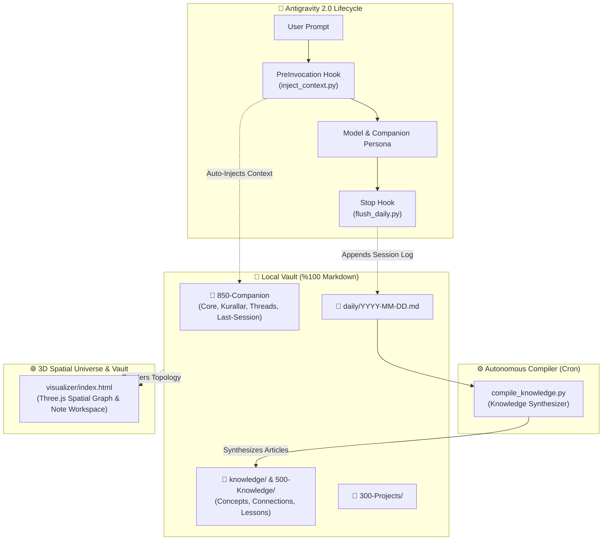

<p align="center">
  
</p>

<h1 align="center">Synapse-AG</h1>

<p align="center">
  <b>Autonomous, Self-Evolving 3D Second Brain & Spatial Knowledge Engine for Google Antigravity 2.0</b>
</p>

<p align="center">
  <a href="README_TR.md">🇹🇷 <b>Türkçe Dokümantasyon için Tıklayın</b></a>
</p>

<p align="center">
  <a href="#-license--attribution"></a>
  <a href="#-quickstart-single-prompt"></a>
  <a href="#-1-3d-spatial-knowledge-universe"></a>
  <a href="#-core-architecture"></a>
  <a href="https://github.com/MertAlii/Synapse-AG"></a>
</p>

<p align="center">
  
</p>

---

## 💡 Overview

**Synapse-AG** is an autonomous AI second brain engine built for Google Antigravity 2.0. It bridges persistent cross-session memory, automatic knowledge graph compilation, and interactive 3D spatial visualization with an Obsidian-style hierarchical workspace into a unified, local-first system.

* **Persistent Memory:** Automatic lifecycle hooks capture session summaries and update learned behavioral rules without manual note-taking.
* **Autonomous Knowledge Graph:** Daily logs are synthesized into connected evergreen articles using an automated compilation pattern.
* **100% Local & Obsidian-Compatible:** Plain `.md` files residing entirely on your machine, fully version-controlled with Git.
* **3D Spatial Navigation & Vault Explorer:** Explore, search, and traverse your thoughts and backlinks inside a real-time WebGL/Three.js universe or a full Obsidian-style note explorer.

---

### 🌌 1. 3D Spatial Knowledge Universe
* **Real-time 3D Force-Directed Graph:** Visualizes live connections between inbox ideas, active projects, knowledge concepts, and companion memories.
* **Cinematic Galaxy Auto-Rotation:** Continuous orbital camera rotation with smart pause on user drag and interaction.
* **Smart Neighbor Highlighting:** Hovering or clicking a node illuminates connected 1-hop neighbors and directional neon particles while dimming unrelated nodes.
* **Interactive Node Inspector:** Click any node to smoothly fly the camera to it, inspect metadata, and traverse `[[backlinks]]`.

<p align="center">
  
</p>

---

### 📑 2. Hierarchical Vault Workspace (Note View)
* **Obsidian-Style Left Sidebar:** Collapsible folder tree (`🔮 850-Companion`, `🏰 300-Projects`, `🧠 500-Knowledge`, `🎯 100-Command-Center`, `daily`, `000-Inbox`) with folder counters and file icons.
* **Full-Text Content Search:** Instant search querying both file metadata and **entire markdown bodies**, displaying matched text snippets directly in the sidebar.
* **Live In-Document Keyword Highlighting:** Clicking search results automatically opens the note and illuminates all matched query keywords with `<mark>` gold glow.
* **Linked Mentions & Backlinks:** Real-time bi-directional backlink explorer for deep non-linear knowledge navigation.

<p align="center">
  
</p>

<p align="center">
  
</p>

---

### 📖 3. Interactive In-App Document Reader
* **Clean YAML Frontmatter Extraction:** Raw YAML frontmatter is automatically parsed into interactive `#tag` chips and direct `[🐙 GitHub Repository ↗]` action buttons.
* **Clickable Obsidian `[[WikiLinks]]`:** Clicking any bidirectional link inside the reader smoothly flies the 3D camera to that node and updates the document view.
* **One-Click Actions:** Copy entire note content, copy relative path, or jump straight into the full Vault Workspace.

<p align="center">
  
</p>

---

### 🔥 4. Dynamic Activity Heatmap Mode
Switch on Heatmap mode to instantly illuminate notes based on recent activity, connection density, and edit frequency:
* 🔴 **90%+ (Neon Rose):** Live notes edited or created in the current/recent session.
* 🟠 **75% - 89% (Warm Amber):** High-priority active projects and core behavioral rules.
* 🟢 **60% - 74% (Emerald):** Frequently referenced evergreen knowledge concepts.
* 🔵 **<60% (Cool Blue):** Foundational reference notes and archived threads.

---

### 🪝 5. Deterministic Lifecycle Hooks (`.agents/hooks.json`)
* **`PreInvocation` (`inject_context.py`):** Automatically injects your companion persona (`Core.md`), recent session context (`Last-Session.md`), active threads (`Threads.md`), and learned user rules (`Kurallar.md`) before the model responds.
* **`Stop` (`flush_daily.py`):** Intercepts session termination and appends a structured summary to `daily/YYYY-MM-DD.md`.

---

### ⏰ 6. Natural Language Scheduling & Cron
Execute autonomous background tasks without writing cron syntax:
* 🗣️ *"Every day at 12:00, compile yesterday's logs and give me a briefing."*
  * ⚙️ **Antigravity Action:** Deploys a background daemon with `CronExpression: "0 12 * * *"` and `IsDaemon: true`.
* 🗣️ *"Remind me to review this project status in 45 minutes."*
  * ⚙️ **Antigravity Action:** Sets a one-shot timer with `DurationSeconds: 2700`.

---

### ⏳ 7. Git Time-Travel Memory (`zaman-yolcusu`)
* The entire vault is version-controlled from day one.
* Ask: *"Why did we change this architecture decision two weeks ago?"*
* The model queries Git logs and diffs to extract the exact rationale and code changes.

---

### 🧪 8. Post-Mortem & Failures Lab (`Lessons.md`)
* Automatically turns mistakes into permanent systemic rules.
* When an unexpected bug occurs, run `post-mortem` to perform a 5-Whys analysis, record the takeaway in `500-Knowledge/Lessons.md`, and add an invariant guardrail to `Kurallar.md`.

---

## 🚀 Quickstart (Single-Prompt)

In your Antigravity 2.0 workspace, provide the master build specification:

```markdown
Read beyin-antigravity.md and build the second brain system in this workspace.
When finished, report all installed components.
```

The installer conducts a brief 1-minute onboarding, constructs the vault tree, connects `.agents/` hooks, and initializes Git versioning.

---

## 🏗️ Core Architecture



---

## 📂 Vault Hierarchy

```text
Synapse-AG/
├── LICENSE                         # MIT License
├── README.md                       # English Documentation
├── README_TR.md                    # Turkish Documentation
├── beyin-antigravity.md            # Master Build Specification
├── ROADMAP_LEVEL_UP.md             # Capability Roadmap (L1 -> L4)
│
├── .agents/                        # Antigravity Control Plane
│   ├── hooks.json                  # Lifecycle Hooks Configuration
│   ├── rules/
│   │   └── memory-protocol.md      # Auto-loaded Context Rules
│   ├── skills/
│   │   ├── beyin-doktor/           # System Diagnostics & Health Audit
│   │   ├── hafiza-derleyici/       # Knowledge Base Compiler
│   │   ├── gecmis-import/          # ChatGPT / Claude / Gemini Importer
│   │   ├── zamanlayici/            # Natural Language Cron & Timer
│   │   ├── zaman-yolcusu/          # Git Time-Travel Memory
│   │   ├── post-mortem/            # Root Cause & Failures Lab
│   │   └── uzman-ajanlar/          # Specialist Subagents
│   └── scripts/
│       ├── inject_context.py       # PreInvocation Context Injector
│       ├── flush_daily.py          # Session End Daily Flusher
│       ├── compile_knowledge.py    # Knowledge Graph Compiler
│       ├── compile_graph.py        # 3D Visualizer & Vault Data Compiler
│       └── doctor.py               # 13-Point Health Audit Engine
│
├── visualizer/                     # 3D Spatial Knowledge Universe & Note Workspace
│   ├── index.html                  # Interactive Three.js Web App & Vault Explorer
│   └── data.js                     # Auto-compiled graph nodes & note contents
│
├── assets/images/                  # High-Res Screenshots & Feature Previews
├── 📥 000-Inbox/Dump/              # Quick Capture & Unprocessed Thoughts
├── 🎯 100-Command-Center/          # Dashboard.md & Active Priorities
├── 🏰 300-Projects/                # Project Workspaces & Repositories
├── 🧠 500-Knowledge/               # Permanent Human Notes & Lessons.md
├── 🔮 850-Companion/               # Companion Memory (Core, Rules, Threads, Sessions)
├── daily/                          # [Machine-Written] Daily Session Logs
├── knowledge/                      # [Machine-Compiled] Concepts & Connections
└── 📋 Templates/                   # Note, Project, and Decision (ADR) Templates
```

---

## 🩺 Diagnostics (`beyin doktor`)

Audit your second brain's health at any time:

```bash
python .agents/scripts/doctor.py
# Or in chat: "beyin doktor"
```

```text
=================================================================
           ANTIGRAVITY BEYIN DOKTORU RAPORU
=================================================================
Bilesen                                          | Durum       
-----------------------------------------------------------------
Kok Yonlendirici (GEMINI.md / beyin-antigravity.md) | [OK] Hazir  
Antigravity Kancalari (.agents/hooks.json)       | [OK] Hazir  
Baglam Enjektoru (inject_context.py)             | [OK] Hazir  
Oturum Loglayici (flush_daily.py)                | [OK] Hazir  
Bilgi Derleyici (compile_knowledge.py)           | [OK] Hazir  
Web 3D Gorsellestirici (visualizer/index.html)   | [OK] Hazir  
Sablon Kasasi (template/)                        | [OK] Hazir  
Git Surum Kontrolu                               | [OK] Git Aktif
=================================================================
[OK] Sistem sapasaglam! Tum hafiza kancalari ve dosyalar hazir.
```

---

## 📜 License & Attribution

Distributed under the **[MIT License](LICENSE)**.

### Inspirations & References:
* **[Avenox](https://avenox.lol)** ([github.com/avenoxai/avenoxbeyin](https://github.com/avenoxai/avenoxbeyin)): Second Brain concept & hook-based workflow.
* **[Andrej Karpathy](https://gist.github.com/karpathy/442a6bf555914893e9891c11519de94f)**: LLM Knowledge Base and autonomous article compilation pattern.
* **[Vasturiano](https://github.com/vasturiano/3d-force-graph)**: 3D Force-Directed Graph WebGL library.

---

<p align="center">
  <b>Synapse-AG</b> — An autonomous, spatial second brain that grows with you. 🚀
</p>
