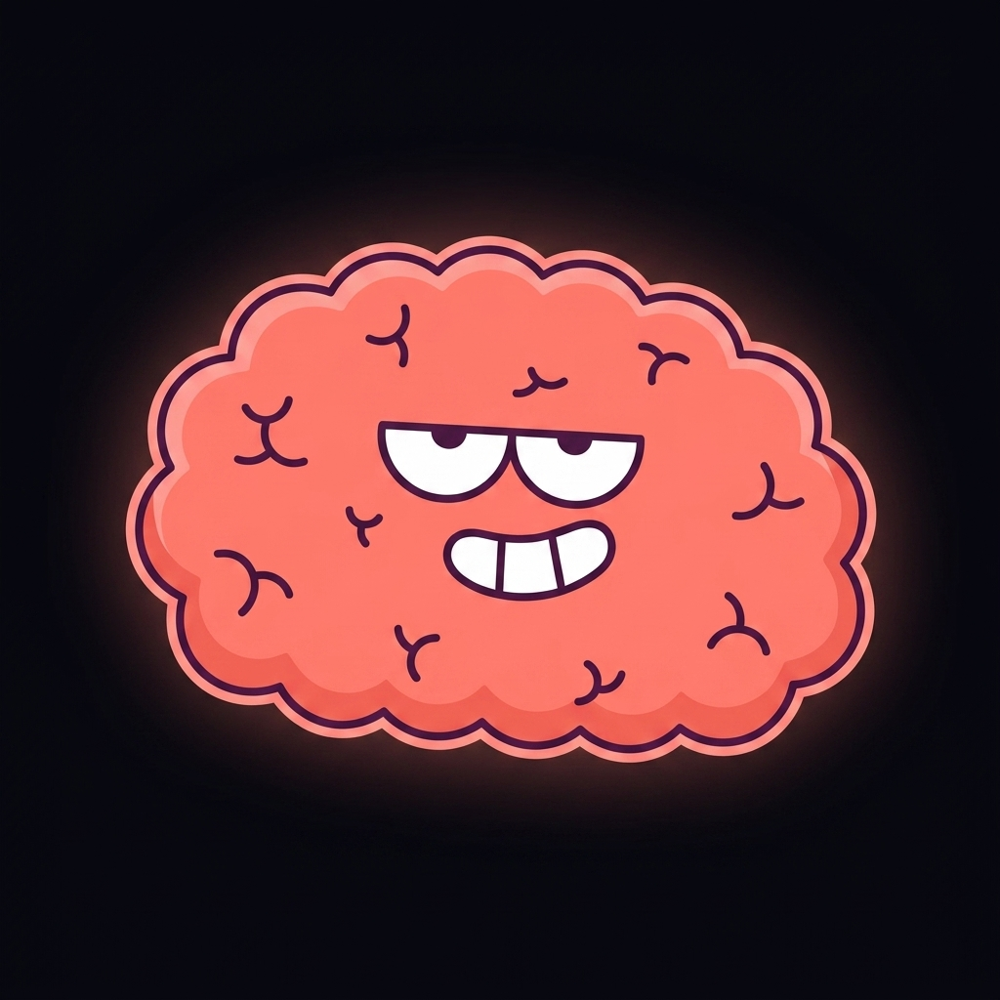
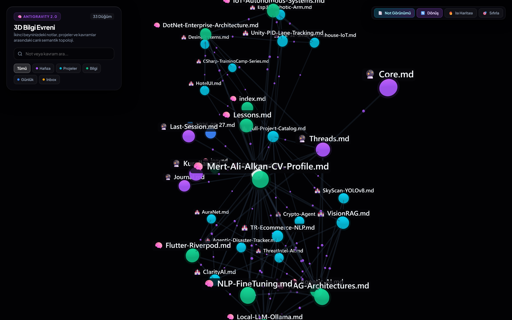
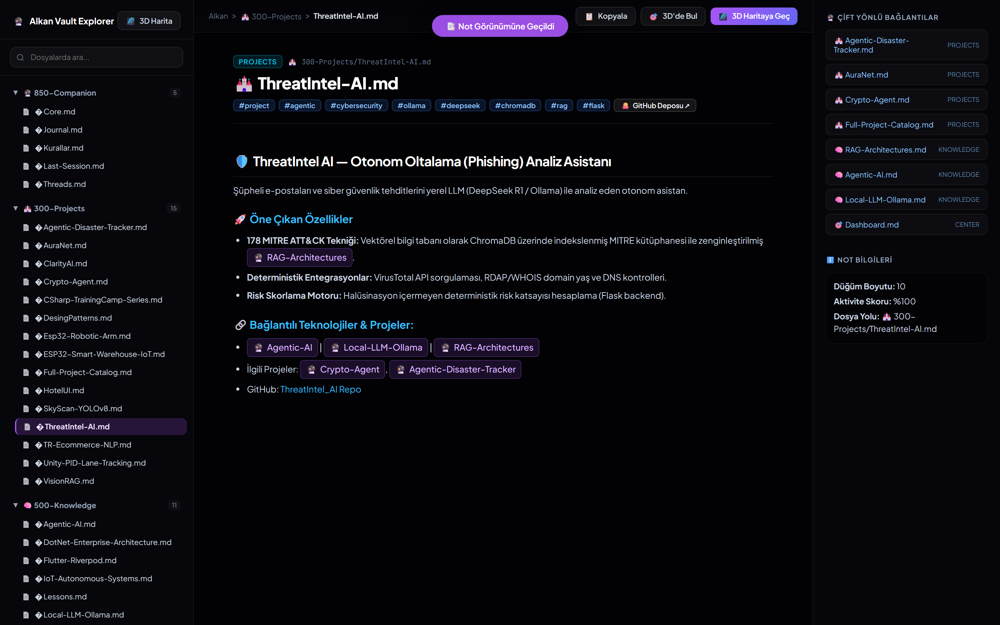
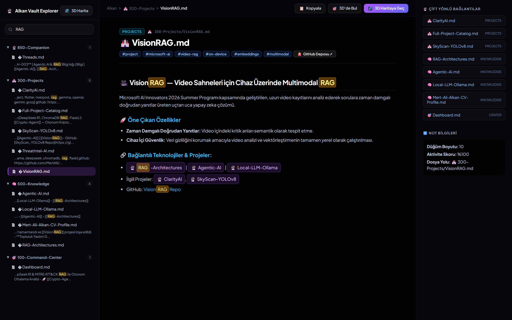
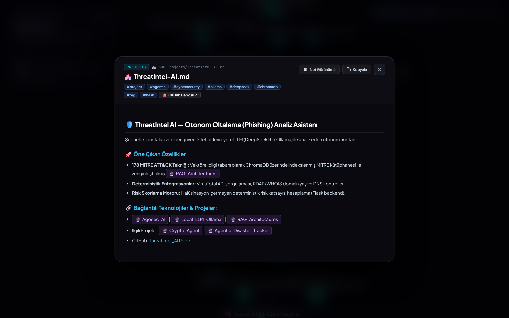

<p align="center">
  
</p>

<h1 align="center">Synapse-AG</h1>

<p align="center">
  <b>Autonomous, Self-Evolving 3D Second Brain & Spatial Knowledge Engine for Google Antigravity 2.0</b>
</p>

<p align="center">
  <a href="README_TR.md">🇹🇷 <b>Türkçe Dokümantasyon için Tıklayın</b></a>
</p>

<p align="center">
  <a href="#-license--attribution"></a>
  <a href="#-quickstart-guide"></a>
  <a href="#-3d-spatial-knowledge-universe"></a>
  <a href="#-core-architecture"></a>
  <a href="https://github.com/MertAlii/Synapse-AG"></a>
</p>

<p align="center">
  
</p>

---

## 💡 Overview

**Synapse-AG** is an autonomous AI second brain and spatial knowledge engine designed for Google Antigravity 2.0. It bridges persistent cross-session memory, automatic bidirectional knowledge graph compilation, and interactive 3D WebGL visualization with an Obsidian-style hierarchical workspace into a unified, local-first system.

* **Persistent Memory & Lifecycle Hooks:** Deterministic hooks capture session summaries, update learned behavioral rules, and inject companion persona before every invocation.
* **3D Spatial Universe (Three.js):** Real-time WebGL force-directed graph with cinematic auto-rotation, glowing halos, particle energy flux, and activity heatmaps.
* **Obsidian-Style Vault Workspace (Note View):** Hierarchical folder tree navigation with live full-text search across document contents and real-time snippet/keyword highlights.
* **Distraction-Free AMOLED Reader Modal:** Clean YAML frontmatter parsing, tag chips, interactive GitHub repository links, and clickable `[[WikiLinks]]`.
* **1-Click Computer Migration & Backup:** Portable brain packaging script (`Beyin-Yedekle.bat` / `migrate_brain.py`) to migrate all memories, projects, and rules across computers with zero data loss.
* **100% Local & Git-Controlled:** Plain Markdown (`.md`) vault residing entirely on your machine.

---

## 🌟 Visual Showcase & Key Features

### 🌌 1. 3D Spatial Knowledge Universe (WebGL / Three.js)
* **Real-time Force Simulation:** Live semantic topology displaying organic orbits between active projects, knowledge pillars, daily logs, and companion memory nodes.
* **Cinematic Galaxy Auto-Rotation:** Smooth continuous orbital camera rotation that gracefully pauses during user interactions and resumes seamlessly.
* **Energy Particle Flux:** Directional neon particles flow through links, visually representing relationship velocity and semantic connections.
* **Activity Heatmap Mode:** Switch on the heatmap to dynamically color-code nodes from cool blue (archival) to neon rose (active session hot-nodes).

<p align="center">
  
</p>

---

### 📑 2. Hierarchical Vault Workspace (Note View)
* **Obsidian-Style Left Sidebar:** Collapsible folder tree (`🔮 850-Companion`, `🏰 300-Projects`, `🧠 500-Knowledge`, `🎯 100-Command-Center`, `daily`, `000-Inbox`) with folder counters and file icons.
* **Full-Text Content Search:** Instant search querying both file metadata and **entire markdown bodies**, displaying matched text snippets directly in the sidebar.
* **Live In-Document Keyword Highlighting:** Clicking search results automatically opens the note and illuminates all matched query keywords with `<mark>` gold glow.
* **Linked Mentions & Backlinks:** Real-time bi-directional backlink explorer for deep non-linear knowledge navigation.

<p align="center">
  
</p>

---

### 🔍 3. Real-Time Full-Text Search with Live Snippets
Search across dozens of project files and technical pillars in milliseconds with contextual excerpt previews and in-situ highlights:

<p align="center">
  
</p>

---

### 📖 4. In-App AMOLED Reader Modal & Frontmatter Engine
* **Clean YAML Frontmatter Extraction:** Raw YAML frontmatter is automatically parsed into interactive `#tag` chips and direct `[🐙 GitHub Repository ↗]` action buttons.
* **Clickable Obsidian `[[WikiLinks]]`:** Clicking any bidirectional link inside the reader smoothly flies the 3D camera to that node and updates the document view.
* **One-Click Actions:** Copy entire note content, copy relative path, or jump straight into the full Vault Workspace.

<p align="center">
  
</p>

---

### 🚀 5. Computer Migration & Portable Brain Packaging
Move your entire second brain to a new machine in seconds:

* **1-Click Packaging (`Beyin-Yedekle.bat`):** Compiles the latest knowledge graph and bundles all memories, projects, rules, and visualizer files into a timestamped `.zip` archive.
* **Instant Cloud Sync via Git:** Push to your GitHub repository and run `git clone https://github.com/MertAlii/Synapse-AG.git` on your new computer.
* **Auto-Restore Script:** Double-click `Yeni-Bilgisayara-Kur.bat` on your new machine to restore and launch the 3D visualizer instantly.

---

## 🏛️ Vault Architecture

```
Synapse-AG/
├── 🔮 850-Companion/           # AI Companion Persona, Core Identity & Learned Rules
│   ├── Core.md                 # System identity & capabilities
│   ├── Kurallar.md             # Auto-learned user rules & behavioral invariants
│   ├── Last-Session.md         # Cross-session continuity state
│   └── Threads.md              # Active goal & project tracking
├── 🏰 300-Projects/            # Project Hubs & Flagship AI/ML/IoT Repositories
│   ├── ThreatIntel-AI.md       # AI Threat Intelligence Engine (DeepSeek R1 + MITRE ATT&CK)
│   ├── Crypto-Agent.md         # Autonomous Crypto Trading Agent (DeepSeek + FastAPI)
│   ├── VisionRAG.md            # On-Device Video Multimodal RAG (Microsoft AI Innovators)
│   ├── ClarityAI.md            # Multimodal Video Understanding Platform
│   └── Full-Project-Catalog.md # Complete index of all 47 GitHub repositories
├── 🧠 500-Knowledge/           # Evergreen Knowledge Pillars & Core Tech Concepts
│   ├── Agentic-AI.md           # Multi-agent systems, ReAct loops & tool protocols
│   ├── RAG-Architectures.md    # Advanced RAG, HyDE, reranking & vector indices
│   ├── Local-LLM-Ollama.md     # On-device LLM inference & quantization
│   └── Mert-Ali-Alkan-CV-Profile.md # Full developer profile, education & skills
├── 🎯 100-Command-Center/      # Central Command Dashboard & Flagship Index
├── 📥 000-Inbox/               # Scratchpad for incoming thoughts and unclassified ideas
├── .agents/                    # Autonomous Scripts, Hooks & Rules
│   ├── hooks.json              # PreInvocation & Stop lifecycle definitions
│   ├── rules/                  # Memory, architecture, and governance protocols
│   └── scripts/                # Graph compiler, doctor & migration engines
└── visualizer/                 # 3D Spatial Knowledge Graph & Vault Web Interface
    ├── index.html              # Three.js 3D WebGL universe & Obsidian Vault UI
    └── data.js                 # Auto-compiled graph nodes, links & full markdown content
```

---

## 🚀 Quickstart Guide

### Prerequisites
* [Python 3.10+](https://www.python.org/)
* Any modern web browser (Edge, Chrome, Brave, Firefox) with WebGL enabled

### 1. Clone the Repository
```bash
git clone https://github.com/MertAlii/Synapse-AG.git
cd Synapse-AG
```

### 2. Launch the 3D Brain & Vault Workspace
Simply double-click:
* **`3D-Beyin.bat`** (or open `visualizer/index.html` in your browser)

### 3. Re-compile Knowledge Graph after Editing Notes
```bash
python .agents/scripts/compile_graph.py
```

### 4. Create a Portable Migration Backup
```bash
python .agents/scripts/migrate_brain.py
# or double-click Beyin-Yedekle.bat
```

---

## 👨‍💻 Developer & Author

* **Developer:** **Mert Ali Alkan**
* **GitHub:** [@MertAlii](https://github.com/MertAlii)
* **Hugging Face:** [@Mer1Alii](https://huggingface.co/Mer1Alii)
* **Role:** Junior Software Developer & AI Systems Engineer

---

## 📄 License

Distributed under the **MIT License**. See `LICENSE` for more information.
