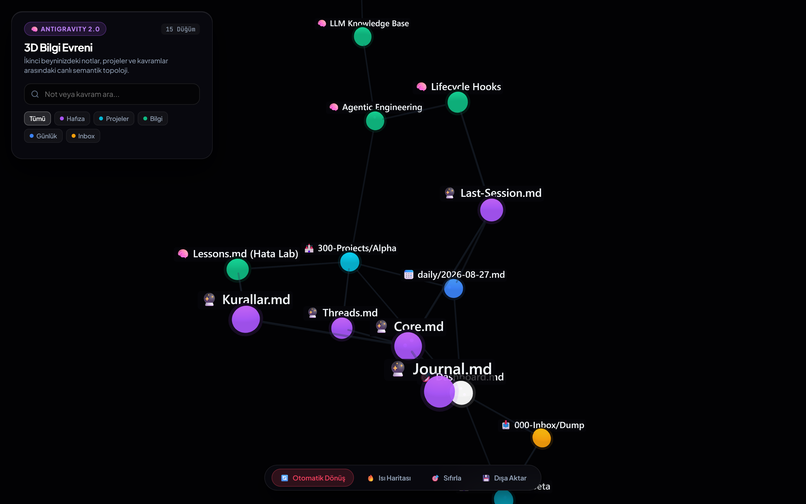
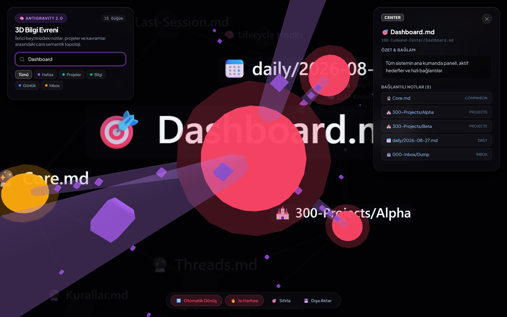
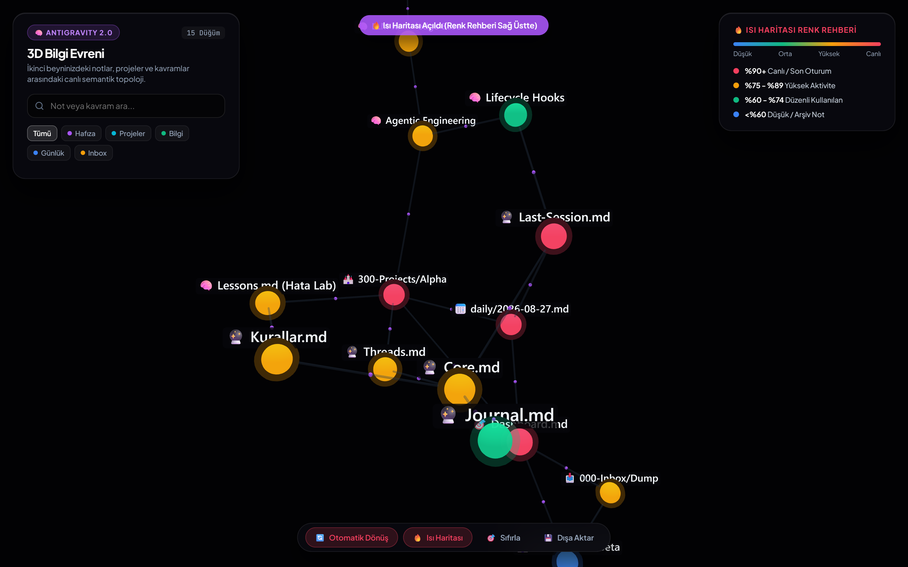
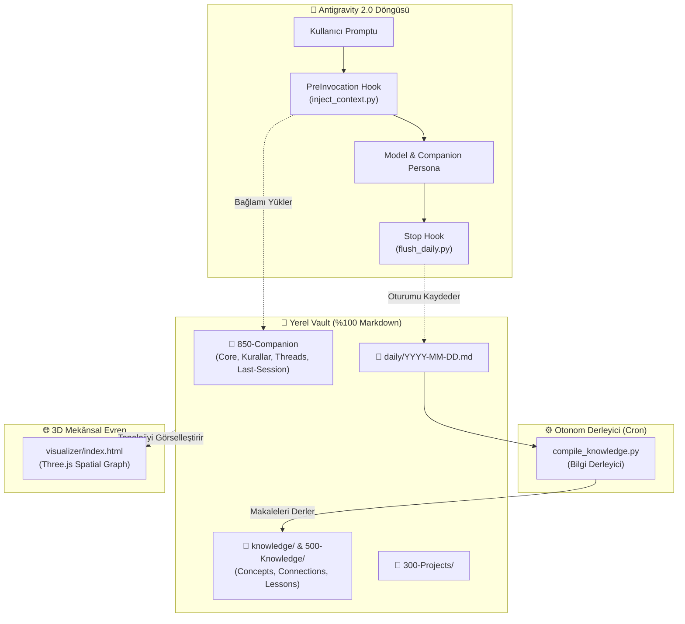

<p align="center">
  
</p>

<h1 align="center">Synapse-AG</h1>

<p align="center">
  <b>Google Antigravity 2.0 için Otonom, Kendi Kendine Gelişen 3D İkinci Beyin ve Mekânsal Bilgi Motoru</b>
</p>

<p align="center">
  <a href="README.md">🇺🇸 <b>Click here for English Documentation</b></a>
</p>

<p align="center">
  <a href="#-lisans--at%C4%B1flar"></a>
  <a href="#-h%C4%B1zl%C4%B1-kurulum-tek-prompt"></a>
  <a href="#-3d-mek%C3%A2nsal-bilgi-evreni"></a>
  <a href="#-temel-mimari"></a>
</p>

<p align="center">
  
</p>

---

## 💡 Genel Bakış

**Synapse-AG**, Google Antigravity 2.0 için geliştirilmiş otonom bir yapay zeka ikinci beyin motorudur. Oturumlar arası kalıcı hafızayı, otomatik bilgi grafiği derlemesini ve etkileşimli 3D görselleştirmeyi yerel tabanlı tek bir çalışma alanında birleştirir.

* **Kalıcı Hafıza:** Oturum kapanışlarını otomatik yakalayan kancalar, elle not alma zorunluluğu olmadan oturum özetlerini ve öğrenilen kuralları kaydeder.
* **Otonom Bilgi Grafiği:** Günlük loglar, otomatik derleme mimarisiyle birbirine bağlı kalıcı kavram makalelerine dönüştürülür.
* **%100 Yerel & Obsidian Uyumlu:** Tamamen sizin bilgisayarınızda yaşayan, Git ile sürümlenmiş saf `.md` dosyaları.
* **3D Mekânsal Gezinme:** Fikirlerinizi, projelerinizi ve bağlantılarınızı gerçek zamanlı bir WebGL/Three.js evreninde keşfedin.

---

### 🌌 1. 3D Mekânsal Bilgi Evreni
* **Gerçek Zamanlı 3D Fizik Simülasyonu:** Fikirler, projeler ve kavramlar arasındaki semantik bağları görselleştirir.
* **Akıllı Komşu Vurgulama:** Bir düğümün üzerine geldiğinizde doğrudan bağlı olduğu komşular parlar, ilgisiz notlar arka plana çekilir.
* **İnteraktif Not Müfettişi:** Tıklanan nota kamerayla yumuşak uçuş, özet bilgisi ve tıklanabilir <code>[[backlinks]]</code> listesi.
* **Tek Tıkla HTML İndirme:** 3D evreninizi harici bağımlılığı olmayan bağımsız bir <code>.html</code> dosyası olarak indirme.

<p align="center">
  
</p>

---

### 🔥 2. Dinamik Aktivite Isı Haritası (Heatmap Mode)
Tek tıkla notların güncellik ve kullanım sıklığına göre parlamasını sağlar:
* 🔴 **%90+ (Neon Kırmızı):** Bugün aktif çalışılan canlı oturumlar.
* 🟠 **%75 - %89 (Sıcak Kehribar):** Yüksek öncelikli aktif projeler ve kurallar.
* 🟢 **%60 - %74 (Zümrüt Yeşili):** Düzenli başvurulan kalıcı bilgi notları.
* 🔵 **<%60 (Sakin Mavi):** Arşiv veya referans notları.

<p align="center">
  
</p>

---

### 🪝 3. Deterministik Yaşam Döngüsü Kancaları (`.agents/hooks.json`)
* **`PreInvocation` (`inject_context.py`):** Siz her yeni prompt yazdığınızda arka planda `🔮 850-Companion/` altındaki son oturumu, kurallarınızı ve aktif hedeflerinizi bağlama otomatik yükler.
* **`Stop` (`flush_daily.py`):** Oturum kapandığında arka planda çalışarak özeti `daily/YYYY-MM-DD.md` içine ekler.

---

### ⏰ 4. Doğal Dil ile Zamanlama (Cron & Scheduler)
Karmaşık cron sözdizimleriyle uğraşmadan doğal dille görev tanımlayın:
* 🗣️ *"Her gün saat 12:00'de dünün loglarını derle ve bana bir brifing hazırla."*
  * ⚙️ **Arka Planda:** Antigravity `schedule` aracını `CronExpression: "0 12 * * *"` ve `IsDaemon: true` ile başlatır.

---

### ⏳ 5. Git Zaman Yolcusu (`zaman-yolcusu`)
* Vault ilk günden itibaren Git ile sürüm kontrolü altındadır.
* *"2 hafta önce bu mimari kararı neden aldık, hangi dosyaları değiştirdik?"* diye sorun; geçmiş commit ve diff'leri tarayarak kanıtlarıyla yanıtlasın.

---

### 🧪 6. Hata & Başarısızlık Laboratuvarı (`Lessons.md`)
* Hataları kalıcı kurallara dönüştürür.
* Beklenmeyen bir sorun çıktığında `post-mortem` yeteneğini çalıştırın; 5-Whys kök neden analizi yapılarak çıkarılan ders `500-Knowledge/Lessons.md` içine, önleyici kural ise `Kurallar.md` içine işlensin.

---

## 🚀 Hızlı Kurulum (Tek Prompt)

Antigravity 2.0 çalışma alanınızda asistana şu komutu vermeniz yeterlidir:

```markdown
beyin-antigravity.md dosyasını oku ve tarif edilen ikinci beyin sistemini bu çalışma alanına kur.
Bitince kurduğun tüm bileşenleri listele.
```

Synapse; sizinle 1 dakikalık kısa bir mülakat yapacak (İsim, Uzmanlık, Kapsam), klasör iskeletini kuracak, `.agents/` kancalarını bağlayacak ve Git sürüm kontrolünü başlatacaktır.

---

## 🏗️ Temel Mimari



---

## 📂 Vault Dizin Yapısı

```text
antigravity-beyin/
├── LICENSE                         # MIT Lisansı
├── README.md                       # İngilizce Ana Dokümantasyon
├── README_TR.md                    # Türkçe Dokümantasyon
├── beyin-antigravity.md            # Master Kurulum Şartnamesi (Build Spec)
├── ROADMAP_LEVEL_UP.md             # Seviye Seviye Yol Haritası (L1 -> L4)
│
├── .agents/                        # Antigravity Kontrol Düzlemi
│   ├── hooks.json                  # Yaşam Döngüsü Kancaları
│   ├── rules/
│   │   └── memory-protocol.md      # Otomatik Yüklenen Bellek Kuralları
│   ├── skills/
│   │   ├── beyin-doktor/           # Sistem Tanı & Sağlık Kontrolü
│   │   ├── hafiza-derleyici/       # Bilgi Tabanı Derleyicisi
│   │   ├── gecmis-import/          # Eski Sohbetleri İçe Aktarma
│   │   ├── zamanlayici/            # Doğal Dil Cron & Zamanlayıcı
│   │   ├── zaman-yolcusu/          # Git Geçmişi ve Zaman Yolculuğu
│   │   ├── post-mortem/            # Kök Neden & Hata Analizi
│   │   └── uzman-ajanlar/          # Çoklu Uzman Alt Ajanlar
│   └── scripts/
│       ├── inject_context.py       # PreInvocation Bağlam Enjektörü
│       ├── flush_daily.py          # Oturum Sonu Günlük Log Yazarı
│       ├── compile_knowledge.py    # Bilgi Tabanı Derleyicisi
│       └── doctor.py               # 13 Noktalı Sağlık Denetim Motoru
│
├── visualizer/                     # 3D Mekânsal Bilgi Evreni
│   ├── index.html                  # Three.js 3D Görselleştirici & Isı Haritası
│   └── capture.py                  # Otomatik Ekran Görüntüsü Alma Scripti
│
├── docs/assets/                    # Ekran Görüntüleri ve Maskot Varlıkları
├── 📥 000-Inbox/Dump/              # Ham Fikir Yakalama
├── 🎯 100-Command-Center/          # Dashboard.md & Öncelikler
├── 🏰 300-Projects/                # Aktif Proje Çalışma Alanları
├── 🧠 500-Knowledge/               # Kalıcı Notlar & Lessons.md
├── 🔮 850-Companion/               # Kalıcı Hafıza (Core, Kurallar, Threads, Last-Session)
├── daily/                          # [Makine Yazar] Günlük Oturum Logları
├── knowledge/                      # [Makine Yazar] Derlenmiş Kavramlar & Bağlantılar
└── 📋 Templates/                   # Not, Proje ve Karar (ADR) Şablonları
```

---

## 🩺 Sağlık Kontrolü (`beyin doktor`)

Sisteminizin sağlık durumunu dilediğiniz zaman denetleyin:

```bash
python .agents/scripts/doctor.py
# veya sohbette: "beyin doktor"
```

```text
=================================================================
           ANTIGRAVITY BEYIN DOKTORU RAPORU
=================================================================
Bilesen                                          | Durum       
-----------------------------------------------------------------
Kok Yonlendirici (GEMINI.md / beyin-antigravity.md) | [OK] Hazir  
Antigravity Kancalari (.agents/hooks.json)       | [OK] Hazir  
Baglam Enjektoru (inject_context.py)             | [OK] Hazir  
Oturum Loglayici (flush_daily.py)                | [OK] Hazir  
Bilgi Derleyici (compile_knowledge.py)           | [OK] Hazir  
Web 3D Gorsellestirici (visualizer/index.html)   | [OK] Hazir  
Sablon Kasasi (template/)                        | [OK] Hazir  
Git Surum Kontrolu                               | [OK] Git Aktif
=================================================================
[OK] Sistem sapasaglam! Tum hafiza kancalari ve dosyalar hazir.
```

---

## 📜 Lisans & Atıflar

Bu proje **[MIT Lisansı](LICENSE)** ile lisanslanmıştır.

### İlham & Teşekkür:
* **[Avenox](https://avenox.lol)** ([github.com/avenoxai/avenoxbeyin](https://github.com/avenoxai/avenoxbeyin)): İkinci Beyin felsefesi ve kanca mimarisi.
* **[Andrej Karpathy](https://gist.github.com/karpathy/442a6bf555914893e9891c11519de94f)**: LLM Bilgi Tabanı ve otomatik derleme konsepti.
* **[Vasturiano](https://github.com/vasturiano/3d-force-graph)**: 3D Force-Directed Graph kütüphanesi.

---

<p align="center">
  <b>Synapse-AG</b> — Yapay zekayı sizinle yaşayan bir bilişsel düşünme ortağına dönüştürün. 🚀
</p>
