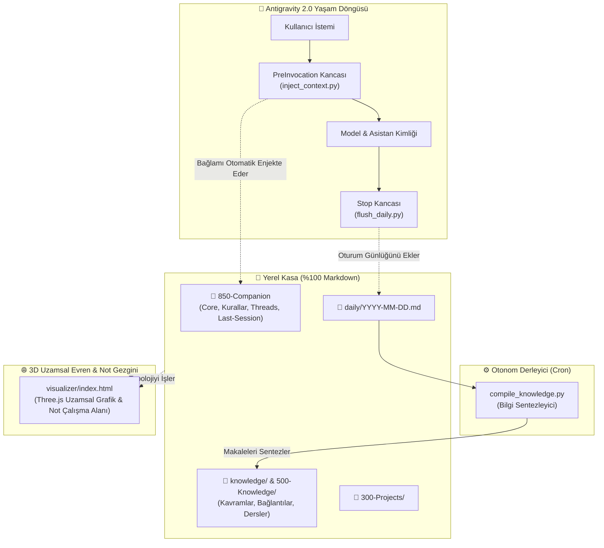

<p align="center">
  
</p>

<h1 align="center">Synapse-AG</h1>

<p align="center">
  <b>Google Antigravity 2.0 için Otonom, Kendini Geliştiren 3D İkinci Beyin ve Uzamsal Bilgi Motoru</b>
</p>

<p align="center">
  <a href="README.md">🌐 <b>Click for English Documentation</b></a>
</p>

<p align="center">
  <a href="#-lisans--at%C4%B1flar"></a>
  <a href="#-h%C4%B1zl%C4%B1-ba%C5%9Flang%C4%B1%C3%A7-tek-istek"></a>
  <a href="#-1-3d-uzamsal-bilgi-evreni"></a>
  <a href="#-%C3%A7ekirdek-mimari"></a>
  <a href="https://github.com/MertAlii/Synapse-AG"></a>
</p>

<p align="center">
  
</p>

---

## 💡 Genel Bakış

**Synapse-AG**, Google Antigravity 2.0 için geliştirilmiş otonom bir yapay zeka ikinci beyin motorudur. Oturumlar arası kalıcı hafızayı, otomatik bilgi grafiği derlemesini ve Three.js tabanlı 3D uzamsal görselleştirmeyi, Obsidian tarzı hiyerarşik bir not çalışma alanıyla tek ve yerel bir sistemde birleştirir.

* **Kalıcı Hafıza:** Otomatik yaşam döngüsü kancaları oturum özetlerini kaydeder ve manuel not almaya gerek kalmadan öğrenilen davranış kurallarını günceller.
* **Otonom Bilgi Grafiği:** Günlük loglar, otomatik bir derleme modeli kullanılarak birbiriyle bağlantılı kalıcı makalelere dönüştürülür.
* **%100 Yerel ve Obsidian Uyumlu:** Tamamen senin bilgisayarında bulunan ve Git ile sürüm kontrolü sağlanan düz `.md` dosyaları.
* **3D Uzamsal Gezinme & Not Gezgini:** Gerçek zamanlı WebGL/Three.js evreninde veya tam Obsidian tarzı not gezgininde düşüncelerini ve geri bağlantılarını keşfet, ara ve dolaş.

---

### 🌌 1. 3D Uzamsal Bilgi Evreni
* **Gerçek Zamanlı 3D Kuvvet Yönelimli Grafik:** Gelen kutusu fikirleri, aktif projeler, bilgi kavramları ve hafıza düğümleri arasındaki canlı bağlantıları uzayda görselleştirir.
* **Sinematik Otomatik Galaksi Dönüşü:** Kullanıcı fareyle dokunduğunda nazikçe duraklayan, etkileşimi bıraktığında uzayda akıcı dönüşüne devam eden yörünge motoru.
* **Akıllı Komşu Vurgulama:** Bir düğümün üzerine gelindiğinde veya tıklandığında bağlı komşuları ve mor enerji partiküllerini aydınlatırken ilgisiz düğümleri karartır.
* **İnteraktif Düğüm Denetçisi:** Kamerayı yumuşakça odaklamak, meta verileri incelemek ve `[[bağlantıları]]` gezmek için herhangi bir düğüme tıklayın.

<p align="center">
  
</p>

---

### 📑 2. Hiyerarşik Not Gezgini (Not Görünümü)
* **Obsidian Tarzı Sol Kenar Çubuğu:** Daraltılabilir klasör ağacı (`🔮 850-Companion`, `🏰 300-Projects`, `🧠 500-Knowledge`, `🎯 100-Command-Center`, `daily`, `000-Inbox`), dosya sayaçları ve simgeleri.
* **İçerik İçi Tam Metin Arama:** Yalnızca dosya adlarını değil, **tüm markdown gövde metinlerini** arar ve eşleşen cümle alıntılarını (`snippet`) sol panelde canlı gösterir.
* **Canlı Doküman İçi Kelime Vurgulama:** Arama sonucundaki bir nota tıklandığında doküman açılır ve aranan kelimeler **`<mark>` altın rengi parlama** ile vurgulanır.
* **Çift Yönlü Bağlantılar:** Açık olan nota referans veren diğer tüm notları listeleyen gerçek zamanlı bağlantı paneli.

<p align="center">
  
</p>

<p align="center">
  
</p>

---

### 📖 3. Dahili İnteraktif Doküman Okuyucu
* **Temiz YAML Frontmatter Motoru:** Ham YAML başlıkları otomatik olarak `#etiket` rozetlerine ve doğrudan `[🐙 GitHub Deposu ↗]` butonlarına dönüştürülür.
* **Tıklanabilir Obsidian `[[WikiLink]]` Bağlantıları:** Okuyucu içindeyken bağlantılı bir nota tıklandığında 3D kamera o nota uçar ve doküman güncellenir.
* **Hızlı Eylemler:** Not içeriğini kopyalama, dosya yolunu alma veya tam Not Gezginine geçiş yapma imkanı.

<p align="center">
  
</p>

---

### 🔥 4. Dinamik Aktivite Isı Haritası Modu
Notları son etkinlik, bağlantı yoğunluğu ve düzenleme sıklığına göre anında renklendirmek için Isı Haritası modunu açın:
* 🔴 **%90+ (Neon Gül):** Mevcut/son oturumda düzenlenen veya oluşturulan canlı notlar.
* 🟠 **%75 - %89 (Sıcak Kehribar):** Yüksek öncelikli aktif projeler ve temel davranış kuralları.
* 🟢 **%60 - %74 (Zümrüt):** Sıkça başvurulan kalıcı bilgi kavramları.
* 🔵 **<%60 (Soğuk Mavi):** Temel referans notları ve arşivlenmiş başlıklar.

---

### 🪝 5. Deterministik Yaşam Döngüsü Kancaları (`.agents/hooks.json`)
* **`PreInvocation` (`inject_context.py`):** Model yanıt vermeden önce asistan kişiliğini (`Core.md`), son oturum bağlamını (`Last-Session.md`), aktif konuları (`Threads.md`) ve öğrenilen kullanıcı kurallarını (`Kurallar.md`) otomatik olarak enjekte eder.
* **`Stop` (`flush_daily.py`):** Oturum sonlandığında araya girerek `daily/YYYY-MM-DD.md` dosyasına yapılandırılmış bir özet ekler.

---

### ⏰ 6. Doğal Dilde Zamanlama & Cron
Cron sözdizimi yazmadan otonom arka plan görevleri çalıştırın:
* 🗣️ *"Her gün saat 12:00'de dünün loglarını derle ve bana bir brifing ver."*
  * ⚙️ **Antigravity Eylemi:** `CronExpression: "0 12 * * *"` ve `IsDaemon: true` ile bir arka plan görevi başlatır.
* 🗣️ *"45 dakika sonra bu proje durumunu gözden geçirmemi hatırlat."*
  * ⚙️ **Antigravity Eylemi:** `DurationSeconds: 2700` ile tek seferlik bir zamanlayıcı ayarlar.

---

### ⏳ 7. Git Zaman Yolculuğu Hafızası (`zaman-yolcusu`)
* Tüm kasa ilk günden itibaren sürüm kontrolü altındadır.
* Sorun: *"İki hafta önce bu mimari kararını neden değiştirdik?"*
* Model, kesin gerekçeyi ve kod değişikliklerini çıkarmak için Git loglarını ve diff'leri sorgular.

---

### 🧪 8. Post-Mortem & Hatalar Laboratuvarı (`Lessons.md`)
* Hataları otomatik olarak kalıcı sistemsel kurallara dönüştürür.
* Beklenmeyen bir hata oluştuğunda, 5-Neden analizi yapmak, çıkarılan dersi `500-Knowledge/Lessons.md` dosyasına kaydetmek ve `Kurallar.md` dosyasına bir kural eklemek için `post-mortem` çalıştırın.

---

## 🚀 Hızlı Başlangıç (Tek İstek)

Antigravity 2.0 çalışma alanınızda ana kurulum şartnamesini sağlayın:

```markdown
Read beyin-antigravity.md and build the second brain system in this workspace.
When finished, report all installed components.
```

Yükleyici kısa bir 1 dakikalık karşılama yürütür, kasa ağacını oluşturur, `.agents/` kancalarını bağlar ve Git sürüm oluşturmayı başlatır.

---

## 🏗️ Çekirdek Mimari



---

## 📂 Kasa Hiyerarşisi

```text
Synapse-AG/
├── LICENSE                         # MIT Lisansı
├── README.md                       # İngilizce Dokümantasyon
├── README_TR.md                    # Türkçe Dokümantasyon
├── beyin-antigravity.md            # Ana Kurulum Şartnamesi
├── ROADMAP_LEVEL_UP.md             # Yetenek Yol Haritası (L1 -> L4)
│
├── .agents/                        # Antigravity Kontrol Düzlemi
│   ├── hooks.json                  # Yaşam Döngüsü Kancaları Yapılandırması
│   ├── rules/
│   │   └── memory-protocol.md      # Otomatik Yüklenen Bağlam Kuralları
│   ├── skills/
│   │   ├── beyin-doktor/           # Sistem Teşhis & Sağlık Denetimi
│   │   ├── hafiza-derleyici/       # Bilgi Tabanı Derleyicisi
│   │   ├── gecmis-import/          # ChatGPT / Claude / Gemini İçe Aktarıcı
│   │   ├── zamanlayici/            # Doğal Dilde Cron & Zamanlayıcı
│   │   ├── zaman-yolcusu/          # Git Zaman Yolculuğu Hafızası
│   │   ├── post-mortem/            # Kök Neden & Hatalar Laboratuvarı
│   │   └── uzman-ajanlar/          # Uzman Alt Ajanlar
│   └── scripts/
│       ├── inject_context.py       # PreInvocation Bağlam Enjektörü
│       ├── flush_daily.py          # Oturum Sonu Günlük Kaydedici
│       ├── compile_knowledge.py    # Bilgi Grafiği Derleyicisi
│       ├── compile_graph.py        # 3D Görselleştirici & Not Verisi Derleyicisi
│       └── doctor.py               # 13 Noktalı Sağlık Denetim Motoru
│
├── visualizer/                     # 3D Uzamsal Bilgi Evreni & Not Çalışma Alanı
│   ├── index.html                  # İnteraktif Three.js Web Uygulaması & Not Gezgini
│   └── data.js                     # Otomatik derlenen düğümler & not içerikleri
│
├── assets/images/                  # Yüksek Çözünürlüklü Ekran Görüntüleri
├── 📥 000-Inbox/Dump/              # Hızlı Yakalama & İşlenmemiş Düşünceler
├── 🎯 100-Command-Center/          # Dashboard.md & Aktif Öncelikler
├── 🏰 300-Projects/                # Proje Çalışma Alanları & Kod Depoları
├── 🧠 500-Knowledge/               # Kalıcı İnsan Notları & Lessons.md
├── 🔮 850-Companion/               # Asistan Hafızası (Core, Kurallar, Konular, Oturumlar)
├── daily/                          # [Makine Yazımı] Günlük Oturum Logları
├── knowledge/                      # [Makine Derlemesi] Kavramlar & Bağlantılar
└── 📋 Templates/                   # Not, Proje ve Karar (ADR) Şablonları
```

---

## 🩺 Sistem Teşhisi (`beyin doktor`)

İkinci beyninizin sağlığını dilediğiniz an denetleyin:

```bash
python .agents/scripts/doctor.py
# Veya sohbette: "beyin doktor"
```

```text
=================================================================
           ANTIGRAVITY BEYIN DOKTORU RAPORU
=================================================================
Bilesen                                          | Durum       
-----------------------------------------------------------------
Kok Yonlendirici (GEMINI.md / beyin-antigravity.md) | [OK] Hazir  
Antigravity Kancalari (.agents/hooks.json)       | [OK] Hazir  
Baglam Enjektoru (inject_context.py)             | [OK] Hazir  
Oturum Loglayici (flush_daily.py)                | [OK] Hazir  
Bilgi Derleyici (compile_knowledge.py)           | [OK] Hazir  
Web 3D Gorsellestirici (visualizer/index.html)   | [OK] Hazir  
Sablon Kasasi (template/)                        | [OK] Hazir  
Git Surum Kontrolu                               | [OK] Git Aktif
=================================================================
[OK] Sistem sapasaglam! Tum hafiza kancalari ve dosyalar hazir.
```

---

## 📜 Lisans & Atıflar

Bu proje **[MIT Lisansı](LICENSE)** ile lisanslanmıştır.

### İlham Kaynakları & Referanslar:
* **[Avenox](https://avenox.lol)** ([github.com/avenoxai/avenoxbeyin](https://github.com/avenoxai/avenoxbeyin)): İkinci Beyin konsepti ve kanca tabanlı iş akışı.
* **[Andrej Karpathy](https://gist.github.com/karpathy/442a6bf555914893e9891c11519de94f)**: LLM Bilgi Tabanı ve otonom makale derleme modeli.
* **[Vasturiano](https://github.com/vasturiano/3d-force-graph)**: 3D Force-Directed Graph WebGL kütüphanesi.

---

<p align="center">
  <b>Synapse-AG</b> — Sizinle birlikte büyüyen otonom, uzamsal bir ikinci beyin. 🚀
</p>
