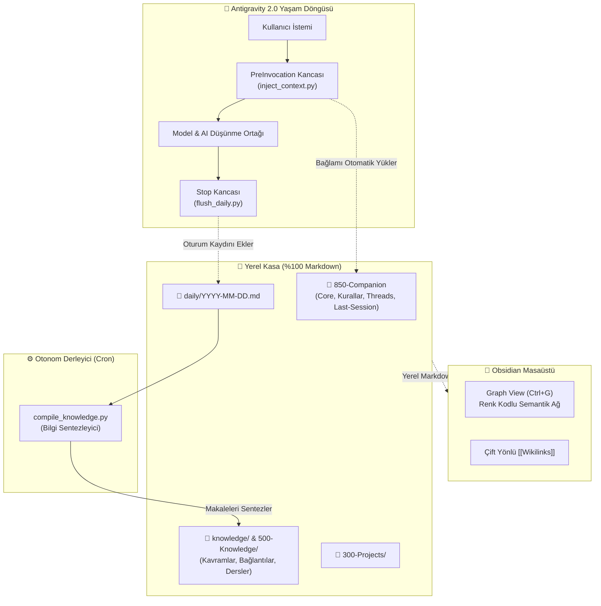

<p align="center">
  
</p>

<h1 align="center">Synapse-AG</h1>

<p align="center">
  <b>Google Antigravity 2.0 & Obsidian için Kendi Kendine Hatırlayan, Otonom İkinci Beyin & Bilgi Motoru</b>
</p>

<p align="center">
  <a href="README.md">🇬🇧 <b>Click for English Documentation</b></a>
</p>

<p align="center">
  <a href="#-lisans--kaynaklar"></a>
  <a href="#-tek-komutla-hızlı-kurulum"></a>
  <a href="#-obsidian-entegrasyonu"></a>
  <a href="#-mimari-yapı"></a>
  <a href="https://github.com/MertAlii/Synapse-AG"></a>
</p>

<p align="center">
  
</p>

---

## 💡 Genel Bakış

**Synapse-AG**, **Google Antigravity 2.0** ve **Obsidian** üzerinde çalışan, oturumlar arası hafızası **kendi kendine yazılan ve asla kaybolmayan** yerel bir "İkinci Beyin" ekosistemidir.

* **🧠 Oturumlar Arası Kalıcı Hafıza:** Yaşam döngüsü kancaları (`PreInvocation`, `Stop`) oturum açılışında önceki hafızayı otomatik bağlama aktarır, oturum bittiğinde ise konuşmayı `daily/YYYY-MM-DD.md` içine işler.
* **📚 Otonom Bilgi Derleyicisi:** Günlük ham notlar, Andrej Karpathy'nin LLM Bilgi Tabanı desenine göre `knowledge/concepts/` ve `knowledge/connections/` altında kalıcı makalelere dönüştürülür.
* **💎 Doğrudan Obsidian Entegrasyonu:** Renk kodlu kategorilere sahip Graph View (`Ctrl+G`), Günlük Notlar, Şablonlar, Canvas ve çift yönlü `[[Wikilinks]]` bağlantıları hazır gelir.
* **🛡️ Sıfır Veri Kayıplı Güncelleme:** Semantik sürüm takibi (`.beyin-version`) ve `scripts/upgrade.ps1` betiği ile notlarınıza ve hafızanıza dokunmadan sistem dosyalarını tek komutla güncelleyebilirsiniz.
* **🔒 Eşzamanlılık & Güvenlik:** `portalocker` dosya kilitleme mekanizması sayesinde çoklu alt ajanlar ve arka plan cron görevleri güvenle çalışır.

---

## 🚀 Tek Komutla Hızlı Kurulum

Google Antigravity 2.0 çalışma alanınızda şu komutu verin:

```text
Read beyin-antigravity.md and build the second brain system in this workspace. When finished, report all installed components.
```

Sistem durumunu istediğiniz zaman denetleyin:

```bash
python .agents/scripts/doctor.py
# Veya Antigravity sohbetinde: "beyin doktor"
```

---

## 🔄 Synapse-AG Güncelleme

Yeni bir sürüm yayınlandığında kişisel notlarınızı veya hafızanızı kaybetmeden güncelleyin:

```powershell
.\scripts\upgrade.ps1
```

* **Korunan Dizinler (Asla Dokunulmaz):** `daily/`, `knowledge/`, `📥 000-Inbox/`, `🏰 300-Projects/`, `🧠 500-Knowledge/`, `🔮 850-Companion/`, `📦 900-Archive/`
* **Güncellenen Dosyalar:** `.agents/scripts/`, `.agents/hooks.json`, `.obsidian/`, `beyin-antigravity.md`, `GEMINI.md`
* **Otomatik Yedekleme:** Güncelleme öncesi otomatik `.bak-TIMESTAMP/` yedeği alınır.

---

## 💎 Obsidian Entegrasyonu

İkinci beyninizi **[Obsidian](https://obsidian.md)** ile açın:

1. Obsidian uygulamasını açın -> **"Open folder as vault"** seçin.
2. Synapse-AG klasörünüzü (`~/.gemini/antigravity/scratch/synapse-ag/`) seçin.
3. **`Ctrl+G`** tuşuna basarak **İlişki Grafiğini (Graph View)** açın:
   - 🔮 **Mor:** Düşünme Ortağı & Çekirdek Hafıza (`🔮 850-Companion`)
   - 🏰 **Cyan:** Aktif Projeler (`🏰 300-Projects`)
   - 🧠 **Zümrüt Yeşili:** Kalıcı Bilgi & Hata Laboratuvarı (`🧠 500-Knowledge`, `knowledge/`)
   - 📅 **Mavi:** Günlük Oturum Logları (`daily/`)
   - 📥 **Kehribar:** Hızlı Notlar & Inbox (`📥 000-Inbox`)
   - 🎯 **Beyaz:** Kumanda Merkezi & Dashboard (`🎯 100-Command-Center`)

<p align="center">
  
</p>

---

## 🏗️ Mimari Yapı



---

## 📂 Dizin İskeleti

```text
Synapse-AG/
├── LICENSE                         # MIT Lisansı
├── README.md                       # İngilizce Dokümantasyon
├── README_TR.md                    # Türkçe Dokümantasyon
├── beyin-antigravity.md            # Ana Kurulum Şartnamesi
├── GEMINI.md                       # Kök Yönlendirici Kural Dosyası
├── .beyin-version                  # Semantik Sürüm Takibi (2.1.0)
│
├── .obsidian/                      # Hazır Obsidian Ayarları
│   ├── app.json                    # Wikilinks ve Ek Kuralları
│   ├── appearance.json             # AMOLED Koyu Tema
│   ├── core-plugins.json           # Etkin Çekirdek Eklentiler
│   ├── daily-notes.json            # Günlük Not Yönlendirmesi
│   ├── graph.json                  # Renk Kodlu İlişki Grafiği
│   └── templates.json              # Şablon Dizini Yapılandırması
│
├── .agents/                        # Antigravity Kontrol Düzlemi
│   ├── hooks.json                  # Yaşam Döngüsü Kancaları
│   ├── rules/
│   │   └── memory-protocol.md      # Otomatik Yüklenen Hafıza Kuralları
│   ├── skills/
│   │   ├── beyin-doktor/           # Sistem Tanı & Sağlık Denetimi
│   │   ├── hafiza-derleyici/       # Bilgi Tabanı Derleyicisi
│   │   ├── gecmis-import/          # ChatGPT / Claude / Gemini İçe Aktarıcı
│   │   ├── zamanlayici/            # Doğal Dille Zamanlama & Cron
│   │   ├── zaman-yolcusu/          # Git Geçmişi Hafızası
│   │   ├── post-mortem/            # Kök Neden & Hata Laboratuvarı
│   │   └── uzman-ajanlar/          # Uzman Alt Ajanlar
│   └── scripts/
│       ├── _resolve_root.py        # Merkezi Dizin Çözücü
│       ├── inject_context.py       # Bağlam Enjektörü
│       ├── flush_daily.py          # Oturum Loglayıcı
│       ├── compile_knowledge.py    # Bilgi Derleyici
│       └── doctor.py               # Sistem Tanı Betiği
│
├── scripts/
│   └── upgrade.ps1                 # Güvenli Otomatik Güncelleme Betiği
├── tests/
│   └── test_scripts.py             # Pytest Birim Test Paketi
│
├── 📥 000-Inbox/Dump/              # Hızlı Yakalama & Ham Fikirler
├── 🎯 100-Command-Center/          # Dashboard.md & Aktif Öncelikler
├── 🏰 300-Projects/                # Proje Çalışma Alanları
├── 🧠 500-Knowledge/               # Kalıcı Notlar & Lessons.md
├── 🔮 850-Companion/               # Ortak Hafızası (Core, Kurallar, Threads, Last-Session)
├── daily/                          # [Makine Yazar] Günlük Oturum Logları
├── knowledge/                      # [Makine Yazar] Kavramlar ve Bağlantılar
└── 📋 Templates/                   # Not, Proje ve Karar Şablonları
```

---

## 🩺 Tanı & Sağlık Kontrolü (`beyin doktor`)

Sisteminizin sağlık durumunu dilediğiniz an denetleyin:

```bash
python .agents/scripts/doctor.py
```

```text
=================================================================
     ANTIGRAVITY BEYIN DOKTORU RAPORU (v2.1.0)
=================================================================
Bilesen                                          | Durum       
-----------------------------------------------------------------
Kok Yonlendirici (GEMINI.md / beyin-antigravity.md) | [OK] Hazir  
Versiyon Dosyasi (.beyin-version)                | [OK] Hazir  
Antigravity Kancalari (.agents/hooks.json)       | [OK] Hazir  
Baglam Enjektoru (inject_context.py)             | [OK] Hazir  
Oturum Loglayici (flush_daily.py)                | [OK] Hazir  
Bilgi Derleyici (compile_knowledge.py)           | [OK] Hazir  
Obsidian Yapilandirmasi (.obsidian/)             | [OK] Hazir  
Sablon Kasasi (template/)                        | [OK] Hazir  
Git Surum Kontrolu                               | [OK] Git Aktif
=================================================================
[OK] Sistem sapasaglam! Tum hafiza kancalari ve dosyalar hazir.
```

---

## 📜 Lisans & Kaynaklar

Bu proje **[MIT Lisansı](LICENSE)** altında dağıtılmaktadır.

### İlham & Teşekkür:
* **[Avenox](https://avenox.lol)** ([github.com/avenoxai/avenoxbeyin](https://github.com/avenoxai/avenoxbeyin)): İkinci Beyin konsepti ve kanca mimarisi.
* **[Andrej Karpathy](https://gist.github.com/karpathy/442a6bf555914893e9891c11519de94f)**: LLM Bilgi Tabanı ve otonom makale derleme yaklaşımı.
* **[Obsidian](https://obsidian.md)**: Yerel Markdown bilgi grafiği motoru.

---

<p align="center">
  <b>Synapse-AG</b> — Sizinle birlikte büyüyen, kalıcı yapay zeka ikinci beyniniz. 🚀
</p>
